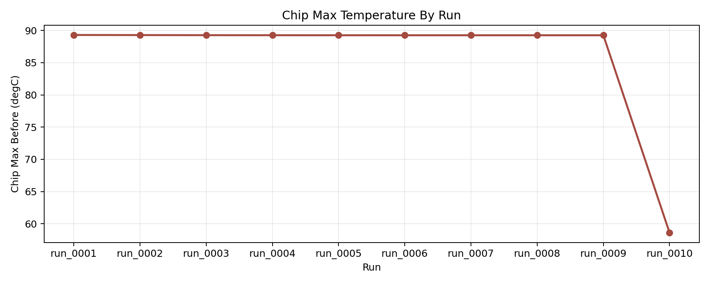
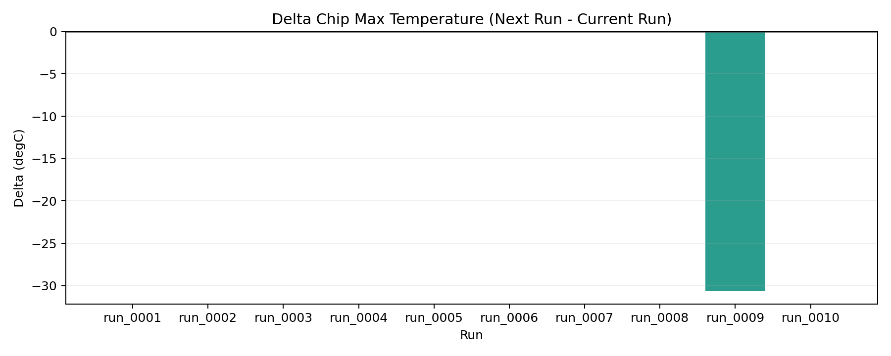
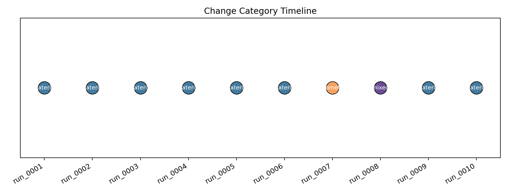

# 当前二维稳态导热单案例实现总览

## 1. 文档定位

这份文档用于归纳当前仓库中这组二维稳态导热单案例的完整实现，重点覆盖以下链路：

- 问题定义
- 组件建模
- 初始摆放与有限元离散
- baseline 仿真结果
- LLM 参与优化的闭环 workflow
- 官方 10 轮演示数据的关键变化与结果

这份文档适合作为：

- 老师演示前的总览讲稿底稿
- 后续中文 Beamer 的内容来源
- 仓库内当前单案例实现状态的统一说明

---

## 2. 问题定义

当前案例是一个 **二维稳态导热** 教学模型，采用 SI 风格单位：

- 长度：`m`
- 温度：`degC`
- 导热率：`W/(m*K)`
- 热源：`W/m^3`

我们研究的问题可以概括为：

> 在一个二维矩形设计域中，放置底板、芯片、热扩展块三个矩形组件；给定材料导热率、边界温度和芯片等效体热源，求解稳态温度场，并在满足约束的前提下，让 LLM 通过结构化修改推动设计改进。

当前最核心的约束是：

- `chip_max_temperature <= 85 degC`

当前边界条件是：

- 左边界：`25 degC`
- 右边界：`25 degC`
- 其余边界：零通量 Neumann 边界

对应的稳态热传导方程为：

```text
-div(k grad(T)) = q
```

其中：

- `T` 是温度场
- `k` 是各子区域上的导热率
- `q` 是芯片区域上的等效体热源

这里的 `85 degC` 不是某个特定产品 datasheet 的认证线，而是当前教学案例里一个工程风格、量级合理的演示阈值。后续如果要面向真实器件，就应该替换成器件结温上限和安全裕量共同定义的真实约束。

---

## 3. 组件建模与最初摆放

当前 baseline 状态定义在：

- `states/baseline_multicomponent.yaml`

设计域是一个矩形：

- `x0 = 0.0`
- `y0 = 0.0`
- `width = 1.2`
- `height = 0.5`

在这个设计域中，放置了 3 个矩形组件：

| 组件 | 左下角 `(x0, y0)` | 尺寸 `(width, height)` | 材料 | 导热率 |
| --- | --- | --- | --- | --- |
| `base_plate` | `(0.0, 0.0)` | `(1.2, 0.2)` | `base_material` | `12.0` |
| `chip` | `(0.45, 0.2)` | `(0.3, 0.12)` | `chip_material` | `45.0` |
| `heat_spreader` | `(0.25, 0.32)` | `(0.7, 0.1)` | `spreader_material` | `90.0` |

热源定义为：

- 在 `chip` 上施加等效体热源 `15000 W/m^3`

这三个矩形组件构成了当前单案例最基础的“组件级热设计”对象：

- 底板 `base_plate` 提供主要向两侧冷端输运的热路径
- 芯片 `chip` 是发热中心
- 热扩展块 `heat_spreader` 用于改善芯片上方的横向扩散

### 3.1 初始布局图


如果想看更完整的图层总览，可以打开：

- [baseline 交互式总览](../outputs/02_multicomponent_steady_heat/figures/overview.html)

从初始布局可以直观看到：

- 底板占据整个下层
- 芯片位于中间偏上位置
- 热扩展块位于芯片正上方，并比芯片更宽

这就是后续 LLM 优化的起点摆放。

### 3.2 网格图


当前基线网格配置为：

- `mesh.nx = 36`
- `mesh.ny = 14`

单元类型为二维三角形网格。

### 3.3 子区域划分图


这一步的作用是把“几何组件”转换成“物理参数场”的承载区域。不同子区域随后会被赋予不同的：

- 导热率 `k`
- 热源 `q`

---

## 4. FEniCSx 中的物理离散与求解

当前求解器使用的是一个标准的线性稳态热问题：

- 温度场函数空间：`Lagrange P1`
- 材料场与热源场：`DG0`

对应的有限元思路是：

1. 在整个设计域上生成网格
2. 依据子区域标签构造分片常数材料场 `k(x)`
3. 在芯片所在区域构造分片常数热源场 `q(x)`
4. 在左右边界施加 Dirichlet 温度边界条件
5. 求解离散线性系统，得到整个二维结构上的温度场

当前求解设置为：

- `solver.kind = steady_heat`
- `solver.linear_solver = lu`

对于教学入门来说，这个设置足够稳定，也方便后续把注意力集中在：

- 几何建模
- 热路径理解
- 约束驱动优化

---

## 5. baseline 的初始仿真结果

当前 baseline 的关键结果为：

- `temperature_min = 25.0 degC`
- `chip_max_temperature = 89.3013 degC`

因此 baseline **不满足** 当前约束：

- `89.3013 degC > 85.0 degC`

这正是后续引入 LLM 优化的原因。

### 5.1 baseline 温度场


如果想看可以缩放和悬浮查看的版本，可以打开：

- [baseline 交互式温度场](../outputs/02_multicomponent_steady_heat/figures/temperature.html)

从这张图可以读出几件事：

- 高温集中在芯片及其邻近区域
- 热扩展块确实参与了热量铺展，但效果有限
- 左右冷端把温度拉回 `25 degC`
- 当前结构仍然存在明显的热点

---

## 6. 为什么要引入 LLM 优化

如果这个案例只是固定脚本求解，那么它能回答的是：

- 给定一个布局，温度场是什么

但它不能直接回答：

- 如果不满足约束，下一步应该改哪里
- 应该改材料、改几何，还是改热源场景
- 每次改动后是否真的更好
- 哪些改动不合法，为什么不合法

因此当前实现引入的不是“LLM 直接改 Python 脚本”，而是：

> LLM 在一个受限的、结构化的、可验证的设计空间里提出修改建议，再由仿真器和验证器来判定这些建议是否有效。

这一步的意义是把整个系统从“单次仿真脚本”升级成“可迭代的设计闭环”。

---

## 7. 当前 LLM 优化闭环怎么工作

当前闭环的核心思路是“状态驱动”，而不是“代码驱动”。

```text
state.yaml
-> compiler 编译几何 / 网格 / 材料场 / 热源场 / PDE
-> FEniCSx 求解
-> evaluator 提取指标并检查约束
-> LLM 生成结构化提案
-> validator 检查提案是否合法
-> 生成 next_state.yaml
-> 进入下一轮
```

这里的关键点有 3 个：

### 7.1 LLM 不直接改脚本

LLM 当前只能修改结构化状态中的注册变量，例如：

- 某个材料的导热率
- 热扩展块的宽度
- 热扩展块的位置
- 芯片热源大小

它不能直接编辑 Python 文件，这样可以避免“模型自由改代码”带来的失控风险。

### 7.2 每一轮都有完整快照

每个 `run_xxxx/` 目录都会保留：

- `state.yaml`
- `evaluation.json`
- `proposal.json`
- `proposal_validation.json`
- `decision.json`
- `next_state.yaml`
- `outputs/`

因此每一轮都：

- 可回放
- 可比较
- 可审计
- 可回滚

### 7.3 proposal 的效果通常在下一轮体现

这是展示时最容易混淆的一点：

- `run_N/evaluation.json` 代表当前状态的结果
- `run_N/proposal.json` 代表本轮准备施加到下一轮的改动
- 真正的效果通常在 `run_{N+1}/evaluation.json` 中体现

所以 `run` 编号既是目录编号，也对应单次 iteration；但“这一轮修改带来了什么效果”，需要用相邻两轮串起来看。

---

## 8. 当前接入的 LLM 与可改参数

当前真实模型接入方式是：

- 平台：DashScope
- 模型：`qwen3.5-plus`

LLM 当前只允许修改注册表里开放的 7 个参数：

| 路径 | baseline 值 | 范围 | 类别 | 作用 |
| --- | --- | --- | --- | --- |
| `materials.spreader_material.conductivity` | `90.0` | `20.0 ~ 500.0` | material | 调整热扩展块导热率 |
| `materials.base_material.conductivity` | `12.0` | `5.0 ~ 250.0` | material | 调整底板导热率 |
| `components.2.width` | `0.70` | `0.20 ~ 1.00` | geometry | 调整热扩展块宽度 |
| `components.2.height` | `0.10` | `0.05 ~ 0.18` | geometry | 调整热扩展块高度 |
| `components.2.x0` | `0.25` | `0.0 ~ 0.5` | geometry | 调整热扩展块水平位置 |
| `components.2.y0` | `0.32` | `0.20 ~ 0.40` | geometry | 调整热扩展块垂直位置 |
| `heat_sources.0.value` | `15000.0` | `5000.0 ~ 50000.0` | load | 场景化调整芯片热源 |

这意味着当前系统已经具备了最小但完整的“参数化设计空间”。

---

## 9. 当前有哪些合法性与安全约束

为了让 LLM 优化保持在可解释、可制造、可回滚的范围内，系统不会直接接受任意 proposal，而是先做验证。

当前已经实现的关键约束包括：

- 导热率必须位于变量上下界内
- 导热率单步变化不能超过 `2.0x`
- 尺寸单步变化不能超过 `1.5x`
- 位置移动不能超过设计域宽高的 `25%`
- 组件不能相互重叠
- 组件不能超出设计域

如果 proposal 非法：

1. 系统仍然保存 proposal
2. 生成 `proposal_validation.json`
3. 在 `decision.json` 中明确标记非法原因
4. 不会偷偷修正并继续

这对老师演示尤其重要，因为它展示的是：

- 系统不是盲从 LLM
- LLM 是被约束和审查的提案者
- 真正的几何与物理边界由系统来守住

---

## 10. 官方 10 轮演示数据

当前已经为老师演示准备了一套固定数据集：

- `demo_runs/official_10_iter/`

这套数据对应的运行方式是：

```bash
cd ~/msfenicsx
conda activate msfenicsx
python examples/03_optimize_multicomponent_case.py --real-llm --max-iters 10 --continue-when-feasible --runs-root demo_runs/official_10_iter
```

这里使用了演示模式参数：

- `--continue-when-feasible`

它的作用是：

- 即使在中途已经满足约束，也继续跑到固定的 `10` 轮

这样做不是正常工程停机策略，而是为了让老师演示时有一整套完整、长度固定的轨迹可讲。

### 10.1 10 轮总体趋势



### 10.2 每轮改善量



### 10.3 修改类别时间线



从这三张图可以看出：

- 前几轮主要在调材料导热率
- 中间穿插了非法提案
- 几何变化被尝试过，但效果有限
- 后面发生了策略切换，并带来了最显著的温度下降

---

## 11. 官方 10 轮中的关键转折

### 11.1 `run_0001 ~ run_0005`

前 5 轮主要在持续提高热扩展块导热率：

- `90 -> 126 -> 200 -> 300 -> 420 -> 500`

热点温度从：

- `89.3013 degC`

缓慢下降到：

- `89.2562 degC`

这说明：

- 提高热扩展块导热率确实有帮助
- 但单靠这一条路径，改善很快进入边际收益递减

### 11.2 `run_0006`

这一轮 proposal 想把：

- `spreader conductivity: 500 -> 700`

但超出了上界 `500`，因此被判定为非法。

这一步适合在演示中强调：

- LLM 会试探边界
- 系统会保留记录并拒绝越界提案

### 11.3 `run_0007 ~ run_0008`

这两轮开始尝试几何方向：

- `run_0007`：把热扩展块宽度从 `0.70` 改为 `0.84`
- `run_0008`：尝试联动修改导热率和宽度，但 proposal 非法

结果表明：

- 几何调大并没有带来明显改善
- 多变量联动仍然要服从边界与步长限制

### 11.4 `run_0009`

这一轮发生了整套 10 轮里最关键的策略切换：

- `materials.base_material.conductivity: 12.0 -> 24.0`

这说明 LLM 从“只盯着热扩展块”切换到了“重新审视下游散热路径是否才是瓶颈”。

### 11.5 `run_0010`

`run_0010` 看到的结果已经大幅改进：

- `chip_max_temperature = 58.6129 degC`

这已经明显满足约束：

- `58.6129 degC < 85.0 degC`

这一轮非常适合作为老师演示里的“关键转折结果”。

---

## 12. 初始状态与 10 轮后状态对比

从 `run_0001` 到 `run_0010`，最终落地到状态中的主要变化如下：

| 项目 | 初始状态 | `run_0010` 状态 |
| --- | --- | --- |
| `spreader conductivity` | `90.0` | `500.0` |
| `base conductivity` | `12.0` | `24.0` |
| `heat_spreader width` | `0.70` | `0.84` |
| `heat_spreader height` | `0.10` | `0.10` |
| `heat_spreader x0` | `0.25` | `0.25` |
| `heat_spreader y0` | `0.32` | `0.32` |
| `chip_max_temperature` | `89.3013 degC` | `58.6129 degC` |

需要注意的是：

- 造成最大改善的关键动作不是继续抬高热扩展块导热率
- 而是第 9 轮把底板导热率从 `12.0` 提高到了 `24.0`

这非常适合讲“热路径瓶颈识别”这个点。

---

## 13. 图片对比：初始布局、优化后布局、温度场变化

### 13.1 初始布局


### 13.2 10 轮后的布局


可以直接看出：

- 热扩展块宽度从 `0.70` 扩大到了 `0.84`
- 其余几何位置没有发生大幅漂移
- 真正起决定性作用的是材料导热路径的重新配置

### 13.3 初始温度场


交互式版本：

- [run_0001 交互式总览](../demo_runs/official_10_iter/run_0001/outputs/figures/overview.html)
- [run_0001 交互式温度场](../demo_runs/official_10_iter/run_0001/outputs/figures/temperature.html)

### 13.4 10 轮后的温度场


交互式版本：

- [run_0010 交互式总览](../demo_runs/official_10_iter/run_0010/outputs/figures/overview.html)
- [run_0010 交互式温度场](../demo_runs/official_10_iter/run_0010/outputs/figures/temperature.html)

这两张温度场对比说明：

- 初始状态存在明显热点
- 后期温度整体显著降低
- 大幅降温来自“整体传热路径变通畅”，而不仅仅是局部热点上方材料变好

---

## 14. 当前这套实现到底证明了什么

当前这组实现证明的不是“LLM 可以替代 FEniCSx 仿真器”，而是：

> LLM 可以在一个受限的、可审计的、可回滚的热设计闭环中参与决策，并通过多轮试探、犯错、修正、再尝试，逐步推动设计满足约束。

更具体地说，它已经具备：

- 结构化 state 驱动建模
- FEniCSx 自动求解与可视化输出
- 约束检查与 objective 提取
- LLM 结构化 proposal
- proposal 合法性验证
- 每轮 run 级别的完整记录
- 演示专用 10 轮固定数据集

---

## 15. 当前局限

这套实现仍然是一个教学级、可扩展的最小闭环，不应直接等同于真实产品热认证模型。当前局限包括：

- 仍然是二维模型
- 仍然是稳态问题
- 还没有引入对流边界
- 还没有引入界面热阻
- 还没有引入瞬态热过程
- 约束仍然是案例级工程阈值，而不是特定产品 datasheet 约束

不过正因为它足够小、足够清晰，才非常适合作为：

- FEniCSx 教学入门模板
- LLM + PDE 闭环优化的展示案例
- 后续扩展更真实物理模型的脚手架

---

## 16. 关键产物位置

当前最值得优先查看的文件和目录如下：

- baseline 状态：
  - `states/baseline_multicomponent.yaml`
- baseline 图片：
  - `outputs/02_multicomponent_steady_heat/figures/`
- LLM workflow 说明：
  - `notes/03_llm_optimization_workflow.md`
- 官方 10 轮数据：
  - `demo_runs/official_10_iter/`
- 官方 10 轮总表：
  - `demo_runs/official_10_iter/demo_summary.md`
- 老师演示脚本：
  - `notes/05_demo_script.md`
- 本文档：
  - `notes/07_single_case_workflow_summary.md`

---

## 17. 一句话总结

当前这组实现已经把一个“二维稳态导热教学例子”升级成了一个：

> 以结构化状态为核心、以 FEniCSx 为仿真内核、以 LLM 为受约束提案者、并且具备图片、指标、决策记录和回滚能力的最小热设计优化闭环。
