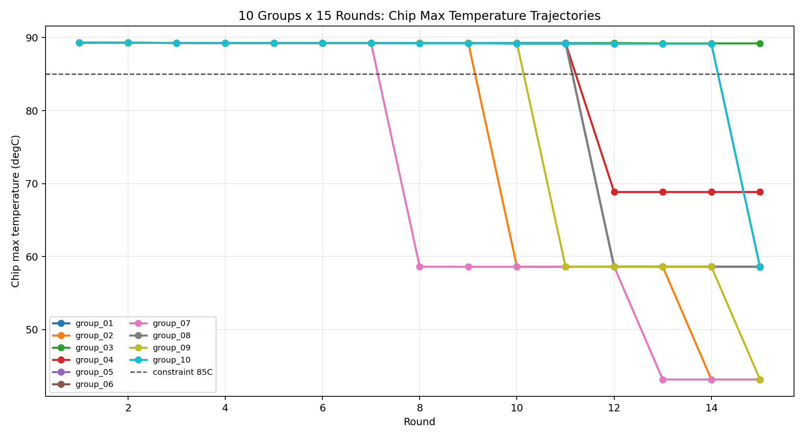
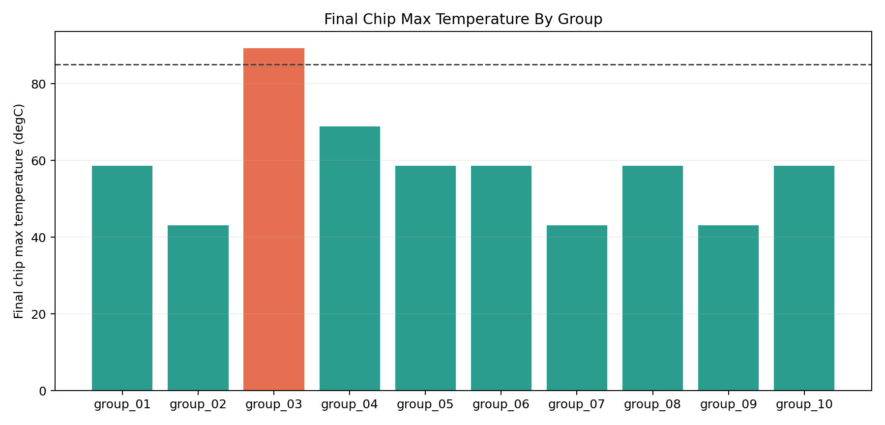
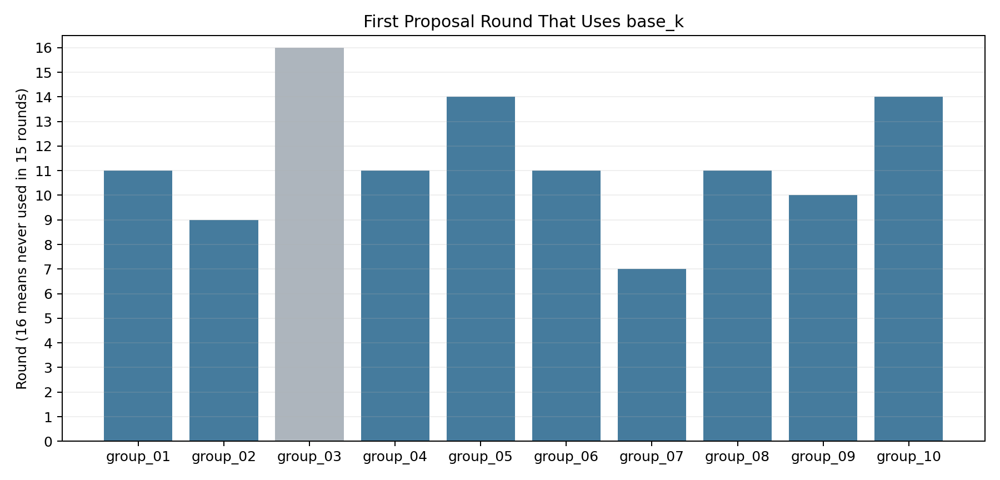

# 10 组独立 LLM 优化对照实验报告（15 轮正式版）

## 1. 实验目标

这次实验的目标是：

- 在**同一个热仿真案例**
- 使用**同一份初始状态**
- 使用**同一套约束**
- 使用**同一个真实 LLM（DashScope `qwen3.5-plus`）**
- 独立重复运行 **10 组**
- 每组固定运行 **15 轮**

观察以下问题：

1. 各组最终芯片峰值温度能降到什么水平
2. 各组优化路径是否一致
3. 关键策略转折是否稳定复现
4. 同样 15 轮预算下，LLM 的最终效果分布是否集中

---

## 2. 正式实验设置

- 初始 state：`states/baseline_multicomponent.yaml`
- 约束：`chip_max_temperature <= 85 degC`
- 模型：DashScope `qwen3.5-plus`
- 运行方式：`--real-llm`
- 轮数：`--max-iters 15`
- 非法提案容忍：`--max-invalid-proposals 15`
- 可行后继续优化：`--continue-when-feasible`

正式实验目录：

- `demo_runs/consistency_10x15_fullwindow_20260326/`

说明：

- 本轮数据是**完整重跑的正式版本**
- 解析器已经做过稳健化处理，避免真实 LLM 输出夹带额外文本时中途崩溃

---

## 3. 最重要结论

这次 10 组正式对照实验的核心结论可以概括成一句话：

> **前半段局部策略高度一致，但最终效果并不唯一，真正决定结果差异的是 LLM 何时切换到 `base_k`，以及切换幅度是否足够激进。**

更具体地说：

- 10 组在前 5 轮几乎都会先把 `spreader_k` 当作第一优先级
- 后续大多会尝试 `spreader_w`，并夹杂少量 `spreader_h / spreader_x`
- 真正拉开差距的关键不是前半段，而是：
  - 有没有想到改 `materials.base_material.conductivity`
  - 第一次想到是在第几轮
  - 是把 `12 -> 24`，还是只做 `12 -> 18`
  - 第二次 `24 -> 48` 是否来得及在 15 轮窗口内兑现

最终结果不是单峰分布，而是明显分成了几档：

- `43.16 degC` 档：`group_02`、`group_07`、`group_09`
- `58.58 ~ 58.61 degC` 档：`group_01`、`group_05`、`group_06`、`group_08`、`group_10`
- `68.85 degC` 档：`group_04`
- `89.20 degC` 档：`group_03`

这说明：

- **局部策略一致性：强**
- **全局最优结果一致性：中等偏弱**
- **进入可行域的一致性：较强（10 组里 9 组可行）**
- **可行后继续深挖到更优结果的一致性：一般**

---

## 4. 全组结果图

### 4.1 全组 15 轮温度轨迹

从这张图可以直接看到：

- 大多数组前半段都停在 `89.2 ~ 89.3 degC` 的平台上
- 一旦切到 `base_k`，温度会出现一次非常大的台阶式下降
- 不同组的主要差别不是“降不降”，而是“在第几轮才开始降”

### 4.2 各组最终芯片峰值温度

这张图更清楚地展示了最终效果分群。

### 4.3 各组第一次动 `base_k` 的轮次

这张图几乎就是本次实验最关键的“策略差异图”。

---

## 5. 10 组结果总表

基线芯片峰值温度在 10 组中完全相同，都是：

- `89.301304 degC`

15 轮后的结果如下：

| 组别 | 最终芯片峰值 | 总改善量 | 改善比例 | valid | invalid | 首次可行轮次 | 首次使用 `base_k` |
| --- | --- | --- | --- | --- | --- | --- | --- |
| `group_01` | `58.612857` | `30.688446` | `34.37%` | `8` | `7` | `run_0012` | `run_0011` |
| `group_02` | `43.164619` | `46.136685` | `51.66%` | `9` | `6` | `run_0010` | `run_0009` |
| `group_03` | `89.204867` | `0.096437` | `0.11%` | `9` | `6` | `无` | `无` |
| `group_04` | `68.848329` | `20.452974` | `22.90%` | `9` | `6` | `run_0012` | `run_0011` |
| `group_05` | `58.577893` | `30.723411` | `34.40%` | `8` | `7` | `run_0015` | `run_0014` |
| `group_06` | `58.612856` | `30.688447` | `34.37%` | `9` | `6` | `run_0012` | `run_0011` |
| `group_07` | `43.164619` | `46.136685` | `51.66%` | `8` | `7` | `run_0008` | `run_0007` |
| `group_08` | `58.612857` | `30.688446` | `34.37%` | `9` | `6` | `run_0012` | `run_0011` |
| `group_09` | `43.164619` | `46.136685` | `51.66%` | `8` | `7` | `run_0011` | `run_0010` |
| `group_10` | `58.577751` | `30.723553` | `34.40%` | `8` | `7` | `run_0015` | `run_0014` |

统计量：

- 最终芯片峰值均值：`58.054127 degC`
- 最终芯片峰值标准差：`13.241831 degC`
- 平均改善量：`31.247177 degC`
- 改善量标准差：`13.241831 degC`
- 最终满足约束的组数：`9 / 10`

解释：

- 均值看起来不错，但标准差并不小
- 说明这不是“10 组几乎完全一样”的稳定收敛，而是“多数组能成功，但成功深度不同”

---

## 6. 策略一致性：一致在哪里，分化又在哪里

### 6.1 高度一致的部分

10 组在前半段非常像，几乎都遵循了下面这条路径：

1. 连续多轮提高 `spreader_k`
2. 当 `spreader_k` 逼近上界后，开始尝试 `spreader_w`
3. 再之后在 `spreader_w / spreader_h / spreader_x` 附近做局部调整

也就是说，LLM 对“最直观热扩散杠杆”的判断非常稳定。

### 6.2 真正分化的部分

真正决定最终结果的，是下面这一步：

> 是否及时把关注点从热扩展块本体，切换到底板导热能力 `base_k`

而且不仅是“有没有想到”，还要看：

- 第一次想到是在第几轮
- 改动幅度是 `12 -> 24` 还是更保守的 `12 -> 18`
- 第二次 `24 -> 48` 能不能在 15 轮内兑现

---

## 7. 五种结果分群

### 7.1 最优组：`43.16 degC` 档

组别：

- `group_02`
- `group_07`
- `group_09`

共同点：

- 都较早切到 `base_k`
- 第一次 `base_k` 提案分别出现在 `run_0009 / run_0007 / run_0010`
- 后面又在窗口内完成了第二次 `base_k` 加强：`24 -> 48`

结果：

- 最终都降到 `43.164619 degC`
- 相比基线改善约 `46.14 degC`
- 改善比例约 `51.66%`

这三组说明：

> **只要足够早识别 `base_k`，并且在 15 轮内来得及完成第二次增强，最终就能进入最好的一档。**

### 7.2 中间主流组：`58.58 ~ 58.61 degC` 档

组别：

- `group_01`
- `group_05`
- `group_06`
- `group_08`
- `group_10`

这些组也成功了，但成功方式略有不同：

- `group_01 / group_06 / group_08`
  - 都在 `run_0011` 第一次改 `base_k`
  - `run_0012` 就出现第一次大幅降温
  - 但第二次 `24 -> 48` 已经拖到 `run_0015`
  - 因为效果要到下一轮才体现，所以 15 轮窗口里来不及看到

- `group_05 / group_10`
  - 第一次 `base_k` 更晚，到 `run_0014`
  - 因此直到 `run_0015` 才第一次进入可行域
  - 也没有时间做第二次增强

所以这 5 组虽然都成功了，但本质上属于：

> **找到了正确杠杆，但时间预算不足以继续把它推到最优。**

### 7.3 部分成功组：`68.85 degC` 档

组别：

- `group_04`

它的关键点在于：

- 也在 `run_0011` 切到了 `base_k`
- 但它不是直接 `12 -> 24`
- 而是更保守地做了 `12 -> 18`

结果：

- `run_0012` 的确出现了大幅降温
- 但只降到 `68.848329 degC`

这说明：

> **不仅“何时切换杠杆”重要，“切换时敢不敢给足幅度”同样重要。**

### 7.4 失败组：`89.20 degC` 档

组别：

- `group_03`

它是唯一一组在 15 轮里都没有进入可行域的组。

其特征非常鲜明：

- 整个 15 轮都没有切到 `base_k`
- 始终停留在 `spreader_k / spreader_w / spreader_h` 的局部空间

结果：

- 最终只从 `89.301304` 降到 `89.204867 degC`
- 改善只有 `0.096437 degC`

这组很有代表性，因为它说明：

> **如果 LLM 一直把注意力锁在局部热扩展块，而没有识别到底板散热路径才是真正瓶颈，那么 15 轮预算几乎会被耗空。**

---

## 8. 关键机制：为什么 `base_k` 这么重要

从这 10 组结果看，当前案例里的真正关键瓶颈并不是：

- 热扩展块导热率不够
- 热扩展块宽度不够

而是：

- 热量能不能继续从热扩展块有效传到底板，并最终导向冷边界

因此：

- `spreader_k` 是“第一眼会想到的局部杠杆”
- `base_k` 才是“真正能改变整体导热路径的全局杠杆”

这也是为什么：

- 提前切到 `base_k` 的组会明显领先
- 没切到 `base_k` 的组几乎不会成功

---

## 9. 对“LLM 是否一致”的直接回答

如果问题是：

> 在同一个案例、同样约束、同样 15 轮预算下，独立重复 10 组真实 LLM 优化，结果是否一致？

那么这次正式实验给出的答案是：

> **部分一致，但不是完全一致。**

更准确地说：

- **前半段策略非常一致**
  - 基本都会先改 `spreader_k`
  - 然后转向 `spreader_w`

- **后半段关键转折不完全一致**
  - 是否想到 `base_k`
  - 想到得早不早
  - 幅度给得大不大
  - 这些决定了最终落在哪一档

因此，你在汇报时可以把结论说成：

> **这个系统已经表现出明显的“局部策略一致性”，但还没有达到“全局最优路径强一致性”。**

---

## 10. 本次实验最值得展示的论点

如果后面给老师演示，我建议你重点讲下面这四点：

1. 同一问题重复跑 10 次，不是每次都走完全一样的路径，但前半段行为非常稳定。
2. 结果分群不是随机噪声，而是能被“第一次切换到 `base_k` 的轮次”和“`base_k` 幅度”解释。
3. 9 组都能进可行域，说明系统并不脆弱；但只有一部分组能进一步压到 `43 degC` 一档，说明全局策略仍有不稳定性。
4. 这正适合后续接入更强的决策约束、记忆机制或策略引导，因为当前瓶颈已经从“不会优化”转成了“关键策略触发时机不稳定”。 

---

## 11. 产物位置

正式实验总目录：

- `demo_runs/consistency_10x15_fullwindow_20260326/`

跨组对照文件：

- `demo_runs/consistency_10x15_fullwindow_20260326/consistency_10x15_group_comparison.json`
- `demo_runs/consistency_10x15_fullwindow_20260326/consistency_10x15_group_comparison.csv`

跨组图：

- `demo_runs/consistency_10x15_fullwindow_20260326/figures/consistency_10x15_trajectories.png`
- `demo_runs/consistency_10x15_fullwindow_20260326/figures/consistency_10x15_final_chip_max.png`
- `demo_runs/consistency_10x15_fullwindow_20260326/figures/consistency_10x15_first_base_k_round.png`

每组单独 summary / figures：

- `demo_runs/consistency_10x15_fullwindow_20260326/group_01/` 到 `group_10/`

本报告：

- `notes/10_llm_consistency_10group_15round_report.md`

---

## 12. 一句话总结

这次正式的 `10 组 x 15 轮` 对照实验表明：

> **LLM 在这个热仿真案例上已经表现出较强的前期策略一致性，但最终效果仍然强烈依赖于是否及时识别 `base_k` 这个全局瓶颈，以及是否在有限轮数内把这个关键杠杆推到足够强。**
